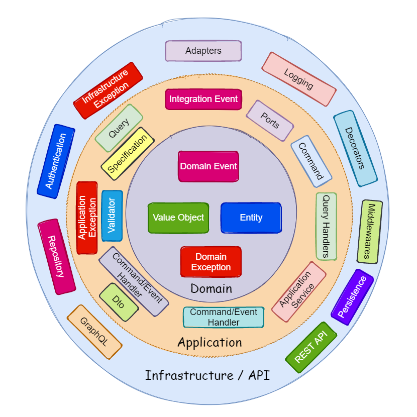

### Thanks to Author of this repository [`Author Link`](https://github.com/meysamhadeli)
### Source Repo [Link](https://github.com/meysamhadeli/University-Microservices)

## 1. The Goals of This Project

- The **microservices** with **DDD** implementation.
- Correct separation of bounded contexts.
- Example of communications between bounded contexts through asynchronous **rabbitMq**.
- Example of simple **CQRS** implementation and **event driven architecture**.
- Using **outbox pattern** for message passing between modules.
- Using **best practice** and **design patterns**.

## 2. Plan
> This project is currently under development.

High-level plan is represented in the table

| Feature | Status |
| ------- | ------ |
| Building Blocks | Completed ✔️ |
| Courses Service | Completed ✔️ |
| Departments Service | Completed ✔️ |
| Instructors Service | Completed ✔️ |
| Students Service | Completed ✔️ |
| Identity Service | Completed ✔️ |
| API Gateway | Under Development 👷‍♂️ |

## 3. Technologies - Libraries
- ✔️ **[`.NET 6`](https://dotnet.microsoft.com/download)** - .NET aspnet-api-versioning)** - Set of libraries which add service API versioning to ASP.NET Web API, OData with ASP.NET Web API, and ASP.NET Core
- ✔️ **[`EF Core`](https://github.com/dotnet/efcore)** - Modern object-database mapper for .NET. It supports LINQ queries, change tracking, updates, and schema migrations
- ✔️ **[`CAP`](https://github.com/dotnetcore/CAP)** - An EventBus with local persistent message functionality for system integration in SOA or Microservice architecture
- ✔️ **[`FluentValidation`](https://github.com/FluentValidation/FluentValidation)** - Popular .NET validation library for building strongly-typed validation rules
- ✔️ **[`Swagger & Swagger UI`](https://github.com/domaindrivendev/Swashbuckle.AspNetCore)** - Swagger tools for documenting API's built on ASP.NET Core
- ✔️ **[`Serilog`](https://github.com/serilog/serilog)** - Simple .NET logging with fully-structured events
Framework 4.5 and higher, which is simple and customisable
- ✔️ **[`Scrutor`](https://github.com/khellang/Scrutor)** - Assembly scanning and decoration extensions for Microsoft.Extensions.DependencyInjection
- ✔️ **[`Opentelemetry-dotnet`](https://github.com/open-telemetry/opentelemetry-dotnet)** - The OpenTelemetry .NET Client
- ✔️ **[`Ocelot`](https://github.com/ThreeMammals/Ocelot)** - API Gateway created using .NET Core
- ✔️ **[`SEQ`](https://github.com/serilog/serilog-sinks-seq)** - Seq collects data over HTTP, while your applications use the best available structured logging APIs for your platform.

## 4. Services Structure
Inner each service used clean architecture but we can use also vertical slice architecture also.

Our clean architecture in each service consists of 4 main parts:
- **Api** - This layer responsible for hosting microservice on .net core webapi and using swagger for documentation.
- **Application** - Here you should find the implementation of use cases related to the module. the application is responsible for requests processing. Application contains use cases, domain events, integration events and its contracts, internal commands.
- **Domain** - Domain Model in Domain-Driven Design terms implements the applicable Bounded Context
- **Infrastructure** - This is where the implementation of secondary adapters should be. Secondary adapters are responsible for communication with the external dependencies.
infrastructural code responsible for module initialization, background processing, data access, communication with Events Bus and other external components or systems

